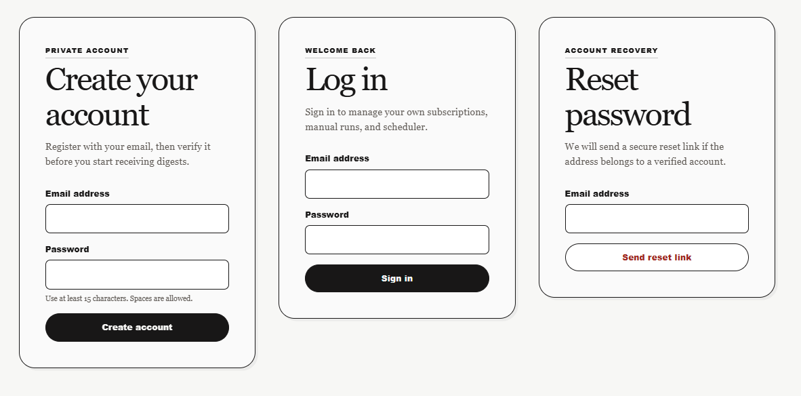
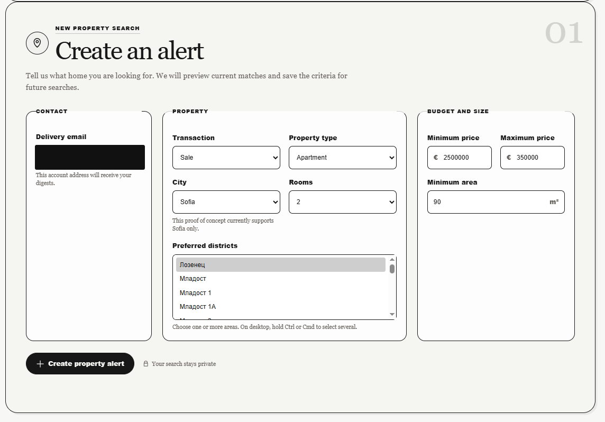
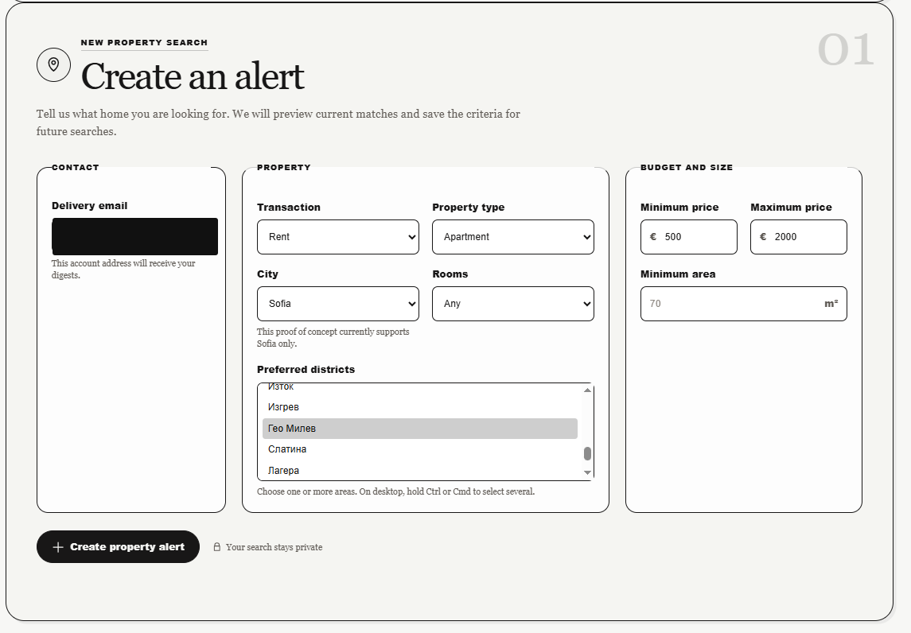
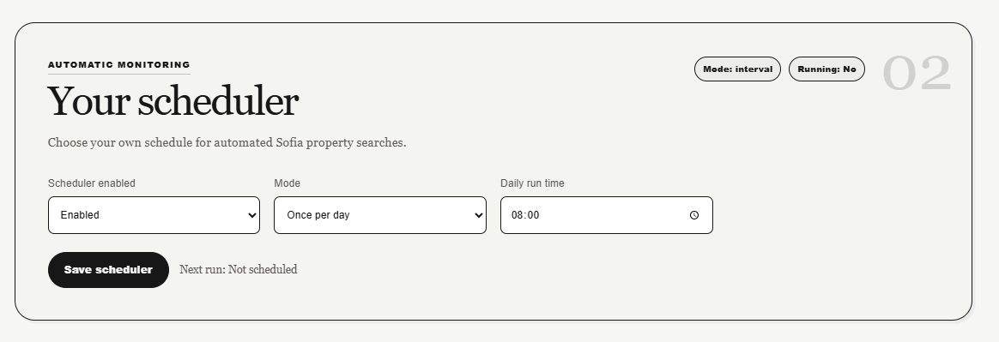
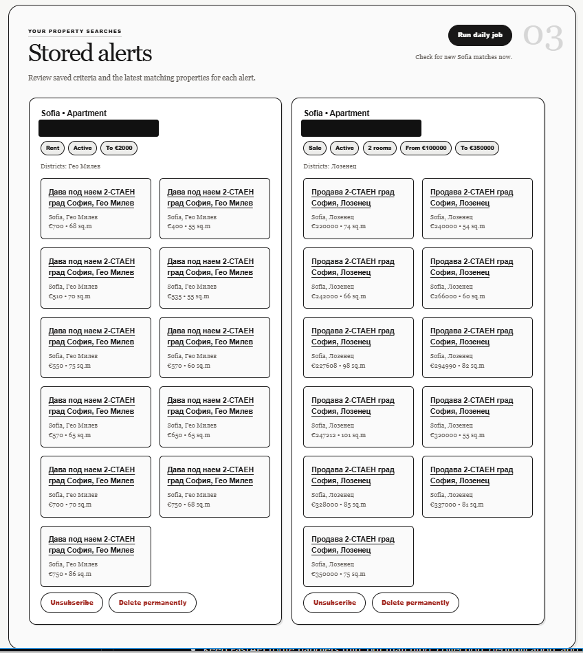
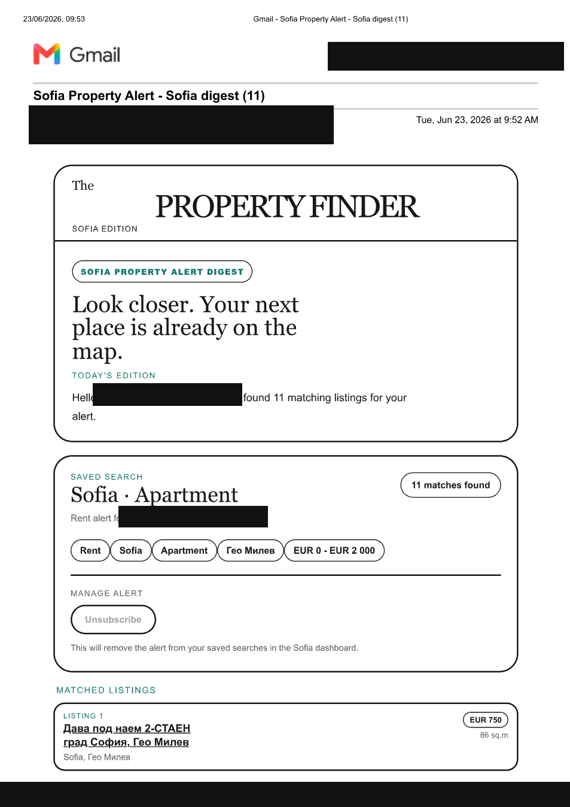
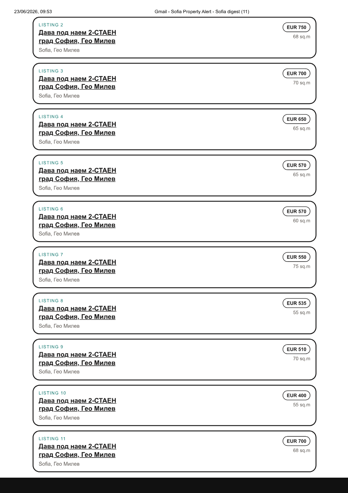
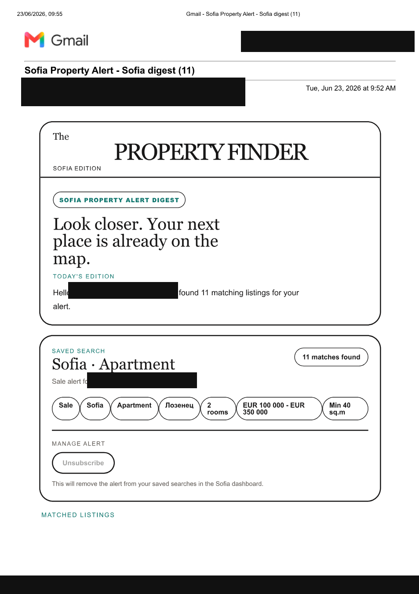
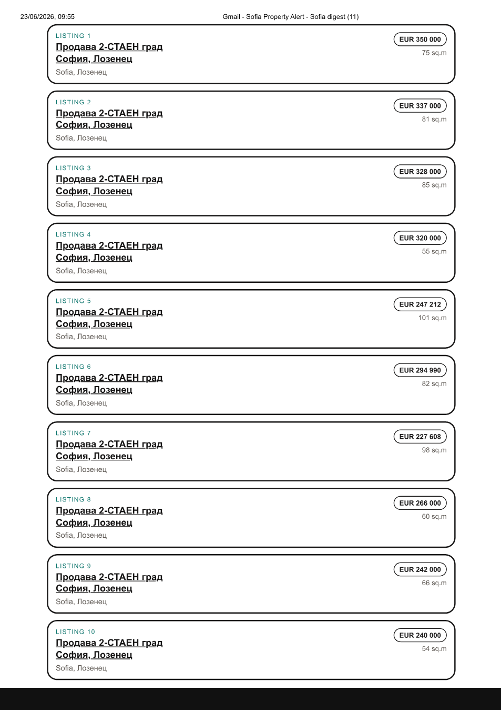

# Sofia Property Alert

## AI-Assisted Development Final Project Report

**Public repository:** <https://github.com/MariaRHristova/sofia-property-alert>

## 1. Project idea and requirements

Sofia Property Alert is a web application for people searching for real estate in Sofia. A registered user creates a private search alert by choosing sale or rent, property type, number of rooms, preferred Sofia districts, price range, and minimum area. The application can query `imot.bg`, normalize returned listings, match them against saved criteria, and produce a newspaper-style email digest. Users can run a search manually or configure their own automatic interval or daily execution time.

The proof of concept was deliberately limited to Sofia. This keeps the live district vocabulary aligned with the Sofia filters and URLs used by `imot.bg`. A fixture-backed provider remains available so the parser and workflow can be demonstrated and tested without depending on a third-party website.

### Functional requirements

- Register with an email address, verify the account, log in, log out, and reset a forgotten password.
- Keep every user's alerts, job history, and schedule private.
- Create, deactivate, reactivate, and permanently delete a search alert.
- Search by transaction, property type, rooms, Sofia district, price, and minimum area.
- Parse and normalize listing data behind an interchangeable provider interface.
- Run the listing job manually or automatically for each user.
- Render HTML and plain-text digests, create local `.eml` previews, and optionally deliver through SMTP.
- Avoid duplicate listing and subscription-match records when a job is repeated.

### Non-functional requirements

The system must be locally runnable, protect credentials through environment configuration, use deterministic automated tests, preserve an offline demonstration path, and keep third-party access respectful. The MVP must stay small enough to explain during the exam while showing clear separation between the web layer, persistence, providers, matching, scheduling, and email delivery.

## 2. Architecture and technological modules

The application uses Python 3.11, FastAPI, Jinja2, SQLAlchemy with SQLite, BeautifulSoup with lxml, APScheduler, httpx, Pytest, and Ruff. FastAPI routes remain thin and delegate to service modules. Configuration chooses fixture or live listing collection and preview or SMTP email delivery.

### AI-assisted planning and execution strategy

The development process intentionally separated strategic planning from implementation. According to the developer's personal notes, the initial architecture and execution plan were prepared in **Plan mode with GPT 5.5 and high reasoning effort**. This was the right place to spend more reasoning: the project still needed scope boundaries, technological modules, a safe fixture-versus-live strategy, an email approach, and an exam-evidence workflow. The approved plan was saved as `plans.md`, making it a persistent repository artifact instead of leaving the strategy only in a chat session.

After the plan was agreed, execution moved to less expensive configurations. The notes record the initial scaffold with **GPT 5.4 at medium reasoning**, followed by smaller implementation iterations with **GPT 5.4 mini and low reasoning**. Lower reasoning was suitable for bounded tasks such as creating files from an approved contract, adjusting selectors, changing template copy, or running focused tests. Higher reasoning was used again when architecture changed substantially, for example when planning per-user authentication and scheduling. This created a practical model-selection pattern: spend reasoning on ambiguity and cross-module decisions, then use lighter execution for well-defined edits.

| Development phase | Recorded Codex configuration | Purpose and evidence |
| --- | --- | --- |
| Project planning | GPT 5.5, high reasoning, Plan mode | Defined MVP scope and modules; saved the approved result in `plans.md`. |
| Agent and workflow design | GPT 5.5, medium reasoning | Created project-local backend, frontend, and integration-review agents plus the `$fullstack-feature` skill. |
| Initial implementation | GPT 5.4, medium reasoning | Translated the approved plan into the FastAPI/SQLAlchemy/Jinja2 scaffold and tests. |
| Small implementation iterations | GPT 5.4 mini, low reasoning | Used for narrower parser, catalog, UI, and debugging edits after the contract was understood. |
| Complex extensions | Higher-reasoning planning followed by focused execution | Used for scheduler design and authenticated multi-user ownership. |
| Debugging | Separate focused sessions | Isolated email, live scraping, UI/browser, scheduler, and authentication problems. |

These model names and reasoning levels come from the developer's contemporaneous notes, not from exported platform telemetry. They are presented as the developer's workflow record rather than an automatically verified usage log.

Three project-local subagents were created to make responsibilities explicit:

- `backend_engineer` owned FastAPI contracts, SQLAlchemy/SQLite, providers, matching, scheduling, and email business logic.
- `frontend_engineer` owned Jinja2 templates, form behavior, accessibility, loading/error states, responsive design, and browser verification.
- `integration_reviewer` was read-only and configured for high reasoning so it could inspect cross-layer contracts, idempotency, security, and test evidence without changing files.

`.codex/config.toml` limited the design to four concurrent threads and one level of delegation. The project-local `$fullstack-feature` skill required backend and frontend contract proposals to be reconciled before implementation and reserved subagents for changes that genuinely crossed layers. This configuration was valuable, but the developer also learned that creating agents does not prove they were invoked in every later session. Because no complete automatic per-call audit log existed, this report distinguishes **configured agent capability** from **verified use** and does not claim that every feature was implemented by a subagent.

Three local skills supported the workflow. `update-exam-evidence` was created from the assignment rubric to maintain `docs/exam-journal.md`. `$fullstack-feature` described safe multi-agent coordination. The third skill, `beautifulsoup-parsing`, was installed locally from `skills.sh/mindrally/skills/beautifulsoup-parsing` and used to guide DOM navigation, safe extraction, URL resolution, missing-field handling, parser choice, and respectful scraping.

### Module 1: Web UI, accounts, and validation

**Approach and reasoning.** The server renders one responsive Jinja2 dashboard rather than introducing a separate JavaScript framework. Pydantic schemas validate incoming alert criteria. Authentication uses opaque server-side sessions in HttpOnly cookies, per-session CSRF tokens, email verification, reset tokens, and `scrypt` password hashing from the Python standard library. Alert, scheduler, and manual-job routes are scoped to the authenticated user.

**AI-assisted workflow.** Codex first built the subscription form and JSON routes, then iterated on visible failures using route tests and browser screenshots. Later prompts expanded the public proof of concept into private accounts and required each user, rather than only an administrator, to control manual and scheduled jobs. Test failures exposed naive SQLite datetimes in token expiry checks and selection of the wrong `.eml` preview; both were corrected.

**Testing.** `tests/test_app_routes.py` covers registration, verification, login, password reset, ownership, subscription operations, and validation responses. The current full suite passes.

**Why Codex.** It could coordinate route, template, CSS, schema, database, and test changes in the same workspace while explaining security decisions.

**Key prompts:** “Focus on minimal working proof of concept”; “Extend the app, so different users can register with their email, log in safely”; “Each user should be able to apply the scheduler and the manual job controls.”

### Module 2: Persistence, matching, and deduplication

**Approach and reasoning.** SQLAlchemy models store users, sessions, account tokens, subscriptions, listings, listing matches, job runs, and per-user scheduler settings. Listing identity is unique by source and external ID, while a subscription-listing pair is also unique. These database constraints make repeated collection idempotent at the storage layer. Pure matching logic compares normalized listing values with the saved transaction, type, city, district, room, price, and area criteria.

**AI-assisted workflow.** Codex separated route handling from `SubscriptionService`, `JobService`, and pure preview matching. It added permanent deletion, token-based deactivation, reactivation, ownership checks, and a small startup migration path for the evolving SQLite proof-of-concept schema. An early global scheduler row with hard-coded ID `1` caused collisions after accounts were added; it was redesigned as one unique scheduler configuration per user.

**Testing.** Temporary databases isolate route and scheduler tests. Uniqueness constraints are implemented in `app/models.py`, and the job service handles an attempted duplicate match without creating a second row.

**Why Codex.** The module required coordinated schema, service, migration, and regression-test changes while preserving existing local data.

**Key prompts:** “Make sure the user can delete a subscription, not only unsubscribe”; “Unsubscribe should deactivate the alert and allow subscribing again”; “Clean up the test data.”

**Known limitation.** Match records are deduplicated, but the current digest query loads all stored matches for an alert. A production-ready next step is to send only matches created during the current run and mark them delivered. Therefore strict “new listings only” delivery is not claimed as complete.

### Module 3: Listing provider and BeautifulSoup parser

**Approach and reasoning.** Source-specific work is hidden behind `ListingProvider`. `FixtureListingProvider` offers deterministic local behavior, while `ImotBgListingProvider` builds Sofia search URLs, downloads result pages, follows pagination, and returns normalized `ListingCandidate` objects. The BeautifulSoup parser targets real listing anchors and card structures, deduplicates repeated URLs, skips sponsored content, derives stable external IDs, and extracts location, price, area, room count, and transaction/property type where available.

**AI-assisted workflow.** The first fixture selectors did not match the live site. Using the project-local `beautifulsoup-parsing` skill, Codex inspected supplied `imot.bg` search and result URLs, planned revised selectors before implementation, and aligned the district catalog with the live Sofia map. A later debugging session clarified that fixture mode, not parser failure, explained why live results were not appearing. Live fetching was moved out of normal page rendering and into explicit user actions so a slow external site cannot block the dashboard.

**Testing.** `tests/test_fixture_parser.py` uses saved HTML rather than network calls and verifies parsing and normalization. Live access is configuration-controlled and is not required by the automated suite.

**Why Codex and the parsing skill.** Codex handled repository-wide integration; the skill supplied a disciplined DOM-inspection and selector-validation workflow.

**Key prompts:** “Use BeautifulSoup parsing to plan how to implement the search properly”; “The filters do not match the imot.bg structure”; “For Sofia the districts are given in the HTML here.”

### Module 4: Job execution and per-user scheduling

**Approach and reasoning.** Manual and scheduled execution call the same `execute_job_run` pipeline. The pipeline loads only the current user's active subscriptions, collects listings through the configured provider, persists listings and matches, renders and delivers digests, and records counts and errors in `JobRun`. APScheduler supports either every N minutes or one daily time in `Europe/Sofia`. Each user has an independent persisted configuration, and a per-user lock prevents overlapping manual and scheduled runs.

**AI-assisted workflow.** The scheduler was first planned as one global proof-of-concept setting and added without removing the manual button. When accounts were introduced, Codex refactored the scheduler into user-specific jobs. UI feedback such as “Preparing your digest” was added after the user reported that clicking the manual job button appeared to do nothing.

**Testing.** `tests/test_scheduler_routes.py` verifies authenticated configuration routes. `tests/test_scheduler_service.py` verifies disabled schedules, job registration, and prevention of overlapping execution. The scheduler can be disabled so tests and local startup remain deterministic.

**Why Codex.** It could keep the scheduler additive, reuse the existing pipeline, and verify service and browser-facing behavior together.

**Key prompts:** “I want to be able to choose the time interval the job runs”; “Keep it as Proof of Concept”; “The user must know that something is happening.”

### Module 5: Email rendering and delivery

**Approach and reasoning.** Rendering is separated from delivery. The email builder creates HTML and plain text for listing and empty-result digests. Every delivery can create a local `.eml` preview, while SMTP is selected through environment settings. This makes the feature demonstrable without exposing credentials or sending mail during tests. Verification and password-reset messages reuse the same delivery path.

**AI-assisted workflow.** Codex scaffolded email delivery, diagnosed Gmail authentication without printing the password, and added explicit delivery results to the UI. Several screenshot-driven refinements transformed the digest from bright blocks into a calmer black-and-white editorial design. A broken flex layout in an inbox was replaced with table markup because email clients render tables more reliably.

**Testing.** `tests/test_email_digest.py` verifies the empty state, listing cards, unsubscribe URL, subject and text alternatives, and approved neutral palette. `tests/conftest.py` forces preview delivery and temporary paths, preventing automated tests from contacting real SMTP.

**Why Codex.** It supported implementation, delivery diagnosis, copywriting, email-safe HTML, and regression testing. The local preview path was more reliable for development than repeatedly testing a live Gmail account.

**Key prompts:** “Add a real email preview/delivery path”; “If there are no listings, also send an email”; “Make the email match the UI style.”

### Module 6: Testing, operational safety, and AI workflow

**Approach and reasoning.** Pytest tests use temporary SQLite databases, fixture HTML, and preview email directories. `scripts/run_pytest_clean.ps1` runs the suite and removes generated test data afterward. Ruff checks imports and style. Environment secrets are excluded from Git, and the app logs job counts and errors without logging passwords.

**AI-assisted workflow.** Codex created the test wrapper after local test records polluted the developer database. Project-local `AGENTS.md`, specialist subagents, a full-stack orchestration skill, and the `update-exam-evidence` skill were introduced to make future work repeatable. In practice, broad subagent orchestration consumed too much context for small tasks; direct single-agent work with focused skills was more efficient. This became an important lesson: agents need narrow ownership and should be used only when genuine parallel work justifies the coordination cost.

**Validation on 23 June 2026.** `powershell -ExecutionPolicy Bypass -File .\scripts\run_pytest_clean.ps1 -q` completed with **20 passed and one upstream Starlette deprecation warning in 8.49 seconds**. `.\.venv\Scripts\python -m ruff check .` returned **All checks passed!**

**Why Codex.** Its strongest advantage was the closed loop between discussion, local editing, command execution, test diagnosis, and evidence capture. Browser availability varied between sessions, so screenshots and deterministic route tests remained important fallbacks.

**Key prompts:** “Create the skill that you suggested for this project”; “Create project-local Codex subagents”; “Add a hook when you do tests to clean up the test data.”

## 3. Challenges, tool assessment, and learning

### 3.1 Turning an open idea into an executable plan

The original idea sounded simple: select criteria and receive new Sofia listings by email. In practice it contained at least seven modules—UI validation, accounts, persistence, parsing, matching, scheduling, and email—and several safety questions. Plan mode with GPT 5.5 and high reasoning was most valuable at this stage because the problem was still ambiguous. It produced an ordered implementation strategy and saved it in `plans.md`. Persisting the plan made later sessions less dependent on chat memory and gave both the developer and Codex a shared checkpoint.

A useful lesson was that reasoning effort should follow uncertainty. High reasoning added value when deciding module boundaries, fixture/live architecture, per-user scheduling, and authentication ownership. It was wasteful for repetitive edits after those decisions were stable. GPT 5.4 medium and GPT 5.4 mini/low reasoning were therefore used for narrower execution iterations. This was not only a cost decision; it reduced the tendency to redesign settled parts of the MVP.

### 3.2 Building and evaluating project-local subagents

Creating the subagents required inspecting the real repository first. The backend agent was specialized for Python 3.11, FastAPI, SQLAlchemy, SQLite, APScheduler, BeautifulSoup, fixture tests, and email boundaries. The frontend agent was specialized for a server-rendered Jinja2 interface rather than assuming React. The integration reviewer was deliberately read-only, with high reasoning, so review could not accidentally modify the implementation it was evaluating.

The `$fullstack-feature` skill acted as an orchestrator: backend and frontend agents were expected to propose one compatible contract before implementation, and the reviewer checked the integrated diff afterward. Concurrency was capped at four threads and depth at one. These limits prevented uncontrolled agent trees.

The experiment also revealed weaknesses. Merely defining an agent does not ensure that the primary agent will invoke it, and the interface did not provide the developer with a simple permanent audit trail of every agent and skill call. On some full-stack iterations, coordination consumed context quickly and produced conflicting route variants that the primary agent then had to reconcile. The developer's blunt but accurate lesson was that an ill-defined agent can be more work than help. For this project, the best use of subagents was substantial, clearly separated work; small changes were better handled directly.

### 3.3 Using a downloaded skill for the BeautifulSoup scraper

The BeautifulSoup task benefited from a specialized external skill. The developer found `mindrally/skills/beautifulsoup-parsing` on `skills.sh` and installed it locally under `skills/beautifulsoup-parsing/`. Keeping it project-local made its instructions reproducible and avoided changing the global Codex environment.

The skill was not treated as a finished scraper. It supplied parsing practices: choose `lxml`, navigate with stable selectors, handle missing elements, clean text, resolve relative URLs, validate types, deal with malformed HTML and encoding, use an explicit user agent, and respect site terms and rate limits. Codex then applied those practices to the actual `imot.bg` pages supplied by the developer.

The first implementation still failed because its fixture selectors did not represent the live result cards. Later, live results appeared absent because the application was still configured for the fixture provider. These were two different problems—parser correctness and runtime provider selection—and separate debugging sessions were needed to distinguish them. The final design keeps both providers: live mode for demonstration and fixtures for deterministic tests.

### 3.4 Separate debugging sessions: useful focus, costly context

Separate sessions were used for the inert subscription button, email preview versus real SMTP delivery, Gmail authentication, live scraper activation, imot.bg filter alignment, scheduler behavior, browser verification, visual design, and later authentication. This helped isolate one failure at a time and allowed different reasoning levels to be chosen for different problems.

The drawback was context fragmentation. A new session did not automatically know which settings, branch of behavior, or previous failed attempt mattered. For example, one session interpreted “no results” as a parser issue before discovering fixture mode; another needed to rediscover the distinction between preview output and SMTP sending. `AGENTS.md`, `plans.md`, tests, and `docs/exam-journal.md` gradually became the durable memory between sessions. This is one of the clearest benefits of repository-local instructions: they reduce dependence on the model's conversational memory.

### 3.5 Email delivery, credentials, and inbox rendering

Email combined security, external configuration, and presentation. Preview mode was initially useful but did not satisfy the requirement to send mail. Gmail SMTP then introduced app-password and authentication debugging. Tests once inherited the developer's `.env`, which risked contacting SMTP and polluting the local database. Temporary test configuration and the cleanup wrapper fixed this.

Inbox HTML created a different class of issue. Flexbox that looked correct in a browser overlapped in the email client, so it was replaced with table-based markup. Bright colors that looked energetic in the application felt distracting in a digest; repeated screenshot feedback moved both surfaces toward restrained newspaper typography and neutral colors.

A credential accidentally appeared in personal notes and was later redacted. Because it entered Git history, deletion from the current file was insufficient; revocation and history cleanup remain necessary. This reinforced the rule that secrets belong only in `.env`, while reports and screenshots must be sanitized.

### 3.6 Browser verification and visible feedback

The developer repeatedly asked whether the embedded browser and subagents were actually being used. That uncertainty led to explicit browser instructions in the frontend workflow: start the server, name the route and viewport, reproduce the bug before editing, reload after the fix, check mobile and desktop when layout is involved, and report exactly what was verified. Browser availability still varied between sessions, so route tests and user-provided screenshots remained important evidence.

Visible progress also became a product requirement. When “Run daily job” gave no immediate feedback, the interface felt broken even when work was happening. Adding “Preparing your digest” demonstrated that correctness includes perceived responsiveness, not only a successful backend response.

### 3.7 Overall tool assessment

**Most helpful tool:** Codex was the central tool because it joined planning, repository inspection, editing, terminal execution, debugging, browser-oriented work, and evidence documentation. Its greatest strength was not any single code suggestion but the closed loop from requirement to change to test result.

**Most helpful specialized skill:** `beautifulsoup-parsing` made the scraper workflow more disciplined and helped translate generic DOM practices into the real imot.bg structure. `update-exam-evidence` was equally important for the exam because it prevented late-stage reconstruction of prompts and results.

**Most helpful artifact:** `plans.md` was the bridge between high-reasoning planning and lower-cost execution. `AGENTS.md` became the bridge between separate sessions.

**Least efficient approach:** Broad multi-agent work on small features. It consumed context, made attribution unclear, and sometimes produced contracts that required reconciliation. The improvement is to delegate only independent, bounded subtasks and record the agent assignment and result in the audit trail.

**Model/reasoning lesson:** High reasoning is best for ambiguity, architecture, and review. Medium reasoning works well for coordinated implementation. Mini/low reasoning is effective for small changes after the contract is fixed. Tests, not reasoning level, determine whether execution is acceptable.

**Developer contribution:** The developer did not passively accept generated output. She narrowed the scope to Sofia, supplied real URLs and screenshots, corrected the fixture/live misunderstanding, demanded real email delivery, changed unsubscribe semantics, requested per-user scheduling, added visible progress, rejected distracting visual designs, and challenged unclear agent/tool usage. Those corrections materially improved the application.

## 4. Working-system evidence

The appendix includes every screenshot artifact prepared for the project. Privacy-safe copies are used here: personal email addresses, the developer's name, verification/reset tokens, and Gmail message URLs are covered. The original files were removed from the repository; sanitized copies are in `docs/report-screenshots/`.

### 4.1 Account registration, login, and recovery

### 4.2 Registration verification email

### 4.3 Password reset email

### 4.4 Authenticated home dashboard

### 4.5 Creating a sale alert

### 4.6 Creating a rent alert

### 4.7 Per-user scheduler

### 4.8 Stored alerts and live matches

### 4.9 Rent digest delivered to Gmail

### 4.10 Sale digest delivered to Gmail

## 5. Future improvements

1. Change delivery state so each digest contains only matches first discovered in that run; record successful delivery per match and retry failures safely.
2. Add focused tests for repeat runs, partial provider or email failures, house-only filtering, garage and sponsored exclusion, room and area boundaries, and pagination.
3. Replace Gmail password-based SMTP with OAuth 2.0 or a dedicated transactional email provider and rotate all development credentials.
4. Add structured application logging and a user-visible run history showing counts, failures, and delivery status.
5. Move scheduled execution to a continuously hosted worker for production; a local APScheduler process stops when the application stops.
6. Add labels, favorites, notes, historical matches, and price charts after the exam MVP is complete.

## Submission note

The source code, automated tests, screenshots, and public repository link are ready for presentation. Before final submission, the report should be copied to a publicly viewable Google Drive document and its share URL recorded in `docs/exam-journal.md`. The exposed Gmail app password found in the original personal notes must be revoked, and sensitive Git history should be cleaned before relying on the public repository as a safe artifact.
