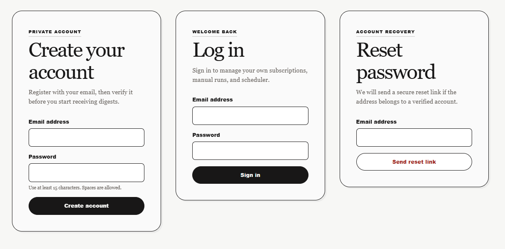
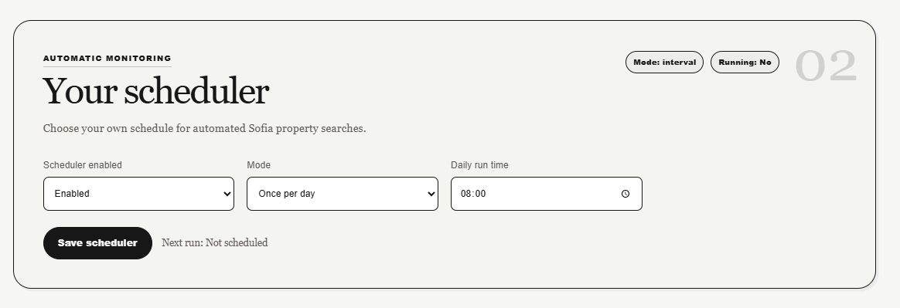

# Sofia Property Alert

## AI-Assisted Development Final Project Report

**Public repository:** <https://github.com/MariaRHristova/sofia-property-alert>

## 1. Project idea and requirements

Sofia Property Alert is a web application for people searching for real estate in Sofia. A registered user creates a private search alert by choosing sale or rent, property type, number of rooms, preferred Sofia districts, price range, and minimum area. The application can query `imot.bg`, normalize returned listings, match them against saved criteria, and produce a newspaper-style email digest. Users can run a search manually or configure their own automatic interval or daily execution time.

The proof of concept was deliberately limited to Sofia. This keeps the live district vocabulary aligned with the Sofia filters and URLs used by `imot.bg`. A fixture-backed provider remains available so the parser and workflow can be demonstrated and tested without depending on a third-party website.

### Functional requirements

- Register with an email address, verify the account, log in, log out, and reset a forgotten password.
- Keep every user's alerts, job history, and schedule private.
- Create, deactivate, reactivate, and permanently delete a search alert.
- Search by transaction, property type, rooms, Sofia district, price, and minimum area.
- Parse and normalize listing data behind an interchangeable provider interface.
- Run the listing job manually or automatically for each user.
- Render HTML and plain-text digests, create local `.eml` previews, and optionally deliver through SMTP.
- Avoid duplicate listing and subscription-match records when a job is repeated.

### Non-functional requirements

The system must be locally runnable, protect credentials through environment configuration, use deterministic automated tests, preserve an offline demonstration path, and keep third-party access respectful. The MVP must stay small enough to explain during the exam while showing clear separation between the web layer, persistence, providers, matching, scheduling, and email delivery.

## 2. Architecture and technological modules

The application uses Python 3.11, FastAPI, Jinja2, SQLAlchemy with SQLite, BeautifulSoup with lxml, APScheduler, httpx, Pytest, and Ruff. FastAPI routes remain thin and delegate to service modules. Configuration chooses fixture or live listing collection and preview or SMTP email delivery.

### Module 1: Web UI, accounts, and validation

**Approach and reasoning.** The server renders one responsive Jinja2 dashboard rather than introducing a separate JavaScript framework. Pydantic schemas validate incoming alert criteria. Authentication uses opaque server-side sessions in HttpOnly cookies, per-session CSRF tokens, email verification, reset tokens, and `scrypt` password hashing from the Python standard library. Alert, scheduler, and manual-job routes are scoped to the authenticated user.

**AI-assisted workflow.** Codex first built the subscription form and JSON routes, then iterated on visible failures using route tests and browser screenshots. Later prompts expanded the public proof of concept into private accounts and required each user, rather than only an administrator, to control manual and scheduled jobs. Test failures exposed naive SQLite datetimes in token expiry checks and selection of the wrong `.eml` preview; both were corrected.

**Testing.** `tests/test_app_routes.py` covers registration, verification, login, password reset, ownership, subscription operations, and validation responses. The current full suite passes.

**Why Codex.** It could coordinate route, template, CSS, schema, database, and test changes in the same workspace while explaining security decisions.

**Key prompts:** “Focus on minimal working proof of concept”; “Extend the app, so different users can register with their email, log in safely”; “Each user should be able to apply the scheduler and the manual job controls.”

### Module 2: Persistence, matching, and deduplication

**Approach and reasoning.** SQLAlchemy models store users, sessions, account tokens, subscriptions, listings, listing matches, job runs, and per-user scheduler settings. Listing identity is unique by source and external ID, while a subscription-listing pair is also unique. These database constraints make repeated collection idempotent at the storage layer. Pure matching logic compares normalized listing values with the saved transaction, type, city, district, room, price, and area criteria.

**AI-assisted workflow.** Codex separated route handling from `SubscriptionService`, `JobService`, and pure preview matching. It added permanent deletion, token-based deactivation, reactivation, ownership checks, and a small startup migration path for the evolving SQLite proof-of-concept schema. An early global scheduler row with hard-coded ID `1` caused collisions after accounts were added; it was redesigned as one unique scheduler configuration per user.

**Testing.** Temporary databases isolate route and scheduler tests. Uniqueness constraints are implemented in `app/models.py`, and the job service handles an attempted duplicate match without creating a second row.

**Why Codex.** The module required coordinated schema, service, migration, and regression-test changes while preserving existing local data.

**Key prompts:** “Make sure the user can delete a subscription, not only unsubscribe”; “Unsubscribe should deactivate the alert and allow subscribing again”; “Clean up the test data.”

**Known limitation.** Match records are deduplicated, but the current digest query loads all stored matches for an alert. A production-ready next step is to send only matches created during the current run and mark them delivered. Therefore strict “new listings only” delivery is not claimed as complete.

### Module 3: Listing provider and BeautifulSoup parser

**Approach and reasoning.** Source-specific work is hidden behind `ListingProvider`. `FixtureListingProvider` offers deterministic local behavior, while `ImotBgListingProvider` builds Sofia search URLs, downloads result pages, follows pagination, and returns normalized `ListingCandidate` objects. The BeautifulSoup parser targets real listing anchors and card structures, deduplicates repeated URLs, skips sponsored content, derives stable external IDs, and extracts location, price, area, room count, and transaction/property type where available.

**AI-assisted workflow.** The first fixture selectors did not match the live site. Using the project-local `beautifulsoup-parsing` skill, Codex inspected supplied `imot.bg` search and result URLs, planned revised selectors before implementation, and aligned the district catalog with the live Sofia map. A later debugging session clarified that fixture mode, not parser failure, explained why live results were not appearing. Live fetching was moved out of normal page rendering and into explicit user actions so a slow external site cannot block the dashboard.

**Testing.** `tests/test_fixture_parser.py` uses saved HTML rather than network calls and verifies parsing and normalization. Live access is configuration-controlled and is not required by the automated suite.

**Why Codex and the parsing skill.** Codex handled repository-wide integration; the skill supplied a disciplined DOM-inspection and selector-validation workflow.

**Key prompts:** “Use BeautifulSoup parsing to plan how to implement the search properly”; “The filters do not match the imot.bg structure”; “For Sofia the districts are given in the HTML here.”

### Module 4: Job execution and per-user scheduling

**Approach and reasoning.** Manual and scheduled execution call the same `execute_job_run` pipeline. The pipeline loads only the current user's active subscriptions, collects listings through the configured provider, persists listings and matches, renders and delivers digests, and records counts and errors in `JobRun`. APScheduler supports either every N minutes or one daily time in `Europe/Sofia`. Each user has an independent persisted configuration, and a per-user lock prevents overlapping manual and scheduled runs.

**AI-assisted workflow.** The scheduler was first planned as one global proof-of-concept setting and added without removing the manual button. When accounts were introduced, Codex refactored the scheduler into user-specific jobs. UI feedback such as “Preparing your digest” was added after the user reported that clicking the manual job button appeared to do nothing.

**Testing.** `tests/test_scheduler_routes.py` verifies authenticated configuration routes. `tests/test_scheduler_service.py` verifies disabled schedules, job registration, and prevention of overlapping execution. The scheduler can be disabled so tests and local startup remain deterministic.

**Why Codex.** It could keep the scheduler additive, reuse the existing pipeline, and verify service and browser-facing behavior together.

**Key prompts:** “I want to be able to choose the time interval the job runs”; “Keep it as Proof of Concept”; “The user must know that something is happening.”

### Module 5: Email rendering and delivery

**Approach and reasoning.** Rendering is separated from delivery. The email builder creates HTML and plain text for listing and empty-result digests. Every delivery can create a local `.eml` preview, while SMTP is selected through environment settings. This makes the feature demonstrable without exposing credentials or sending mail during tests. Verification and password-reset messages reuse the same delivery path.

**AI-assisted workflow.** Codex scaffolded email delivery, diagnosed Gmail authentication without printing the password, and added explicit delivery results to the UI. Several screenshot-driven refinements transformed the digest from bright blocks into a calmer black-and-white editorial design. A broken flex layout in an inbox was replaced with table markup because email clients render tables more reliably.

**Testing.** `tests/test_email_digest.py` verifies the empty state, listing cards, unsubscribe URL, subject and text alternatives, and approved neutral palette. `tests/conftest.py` forces preview delivery and temporary paths, preventing automated tests from contacting real SMTP.

**Why Codex.** It supported implementation, delivery diagnosis, copywriting, email-safe HTML, and regression testing. The local preview path was more reliable for development than repeatedly testing a live Gmail account.

**Key prompts:** “Add a real email preview/delivery path”; “If there are no listings, also send an email”; “Make the email match the UI style.”

### Module 6: Testing, operational safety, and AI workflow

**Approach and reasoning.** Pytest tests use temporary SQLite databases, fixture HTML, and preview email directories. `scripts/run_pytest_clean.ps1` runs the suite and removes generated test data afterward. Ruff checks imports and style. Environment secrets are excluded from Git, and the app logs job counts and errors without logging passwords.

**AI-assisted workflow.** Codex created the test wrapper after local test records polluted the developer database. Project-local `AGENTS.md`, specialist subagents, a full-stack orchestration skill, and the `update-exam-evidence` skill were introduced to make future work repeatable. In practice, broad subagent orchestration consumed too much context for small tasks; direct single-agent work with focused skills was more efficient. This became an important lesson: agents need narrow ownership and should be used only when genuine parallel work justifies the coordination cost.

**Validation on 23 June 2026.** `powershell -ExecutionPolicy Bypass -File .\scripts\run_pytest_clean.ps1 -q` completed with **20 passed and one upstream Starlette deprecation warning in 8.49 seconds**. `.\.venv\Scripts\python -m ruff check .` returned **All checks passed!**

**Why Codex.** Its strongest advantage was the closed loop between discussion, local editing, command execution, test diagnosis, and evidence capture. Browser availability varied between sessions, so screenshots and deterministic route tests remained important fallbacks.

**Key prompts:** “Create the skill that you suggested for this project”; “Create project-local Codex subagents”; “Add a hook when you do tests to clean up the test data.”

## 3. Challenges, tool assessment, and learning

The largest technical challenge was the boundary between a deterministic demonstration and a changing external website. Initial fixture selectors did not represent the real `imot.bg` card structure, and fixture mode was once mistaken for a live-scraping failure. Keeping both providers proved valuable: fixtures make tests stable, while live mode demonstrates integration when the site is reachable and permits access.

Email was the second major challenge. Gmail credential setup, SMTP errors, and inconsistent inbox CSS required both operational debugging and conservative HTML. Separating rendering, preview, and delivery allowed progress without repeatedly exposing credentials or sending real messages.

The third challenge was AI orchestration. Codex was the most helpful tool because it could inspect and modify the local repository, run tests, and preserve a detailed audit trail. The BeautifulSoup skill improved the parsing workflow, and the evidence skill kept the final report factual. The three specialist subagents were useful conceptually, but their coordination overhead and token usage were disproportionate for this MVP. The better pattern was one primary agent, small specialized skills, focused tests, and subagents only for clearly independent tasks.

The developer's corrections materially shaped the result: scope was narrowed to Sofia, fixture/live behavior was clarified, scheduler controls became per-user, unsubscribe became reversible, progress states were added, and the visual direction moved from bright panels to a restrained newspaper style. AI suggestions were treated as drafts and verified against tests, screenshots, and product intent.

## 4. Working-system evidence

### Account registration, login, and recovery

The signed-out page exposes account creation, login, and password recovery without revealing private alert data.

### Per-user automatic monitoring

An authenticated user can enable automatic monitoring and choose an interval or daily execution time. The same user can also run the job manually from the stored-alerts section.

Additional evidence is available in `docs/`, including alert creation, stored alerts, account verification, password reset, and email digest captures. Screenshots containing a personal email address or live token are intentionally excluded from this report.

## 5. Future improvements

1. Change delivery state so each digest contains only matches first discovered in that run; record successful delivery per match and retry failures safely.
2. Add focused tests for repeat runs, partial provider or email failures, house-only filtering, garage and sponsored exclusion, room and area boundaries, and pagination.
3. Replace Gmail password-based SMTP with OAuth 2.0 or a dedicated transactional email provider and rotate all development credentials.
4. Add structured application logging and a user-visible run history showing counts, failures, and delivery status.
5. Move scheduled execution to a continuously hosted worker for production; a local APScheduler process stops when the application stops.
6. Add labels, favorites, notes, historical matches, and price charts after the exam MVP is complete.

## Submission note

The source code, automated tests, screenshots, and public repository link are ready for presentation. Before final submission, the report should be copied to a publicly viewable Google Drive document and its share URL recorded in `docs/exam-journal.md`. The exposed Gmail app password found in the original personal notes must be revoked, and sensitive Git history should be cleaned before relying on the public repository as a safe artifact.
